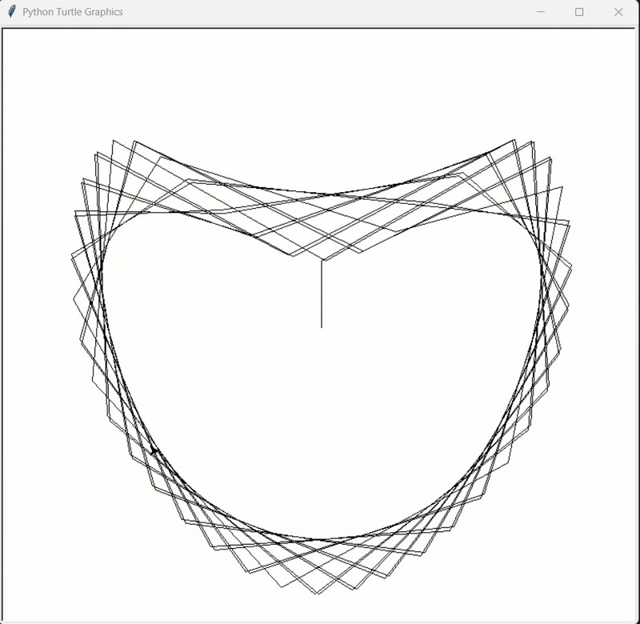

# Heart Drawing with Python 🖤

This is a simple Python project that uses the **`turtle`** graphics library and some math functions to draw a beautiful **`heart shape`**.

---

## Features
- Draws a colorful animated heart using `turtle`.
- Uses `math.sin` and `math.cos` for heart curve calculation.
- Beginner-friendly code to learn Python graphics.

---

## Requirements
- Python 3.8+ (works with 3.13 too)
- `turtle` (comes built-in with Python)
- `math` (comes built-in with Python)

*No extra installation needed...*

---

## Project Preview

[Download video](demo.mp4)

---

## Notes for you:  

- Keep your **`demo.mp4`** in repo or GitHub Releases.  
- Convert your video into **`demo.gif`** so it plays inline.  
